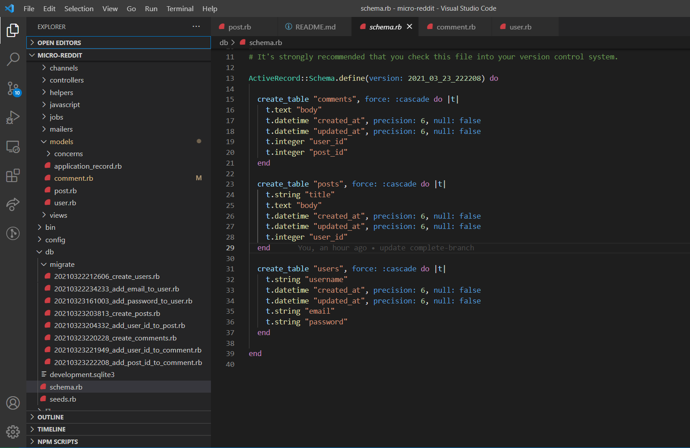

# Project : Active records in Rails

> The project aims to provide a deeper understanding on model in active record by building a Micro-Reddit app. Associations are very simple and illustrated below:
- User owns Posts & Comments
- Post has to belong to a User & Post can have many Comments 
- Comments must belong to a Post & a User



## Built With

- Ruby on Rails

## Getting Started

Model generated:

- user
- comment
- post

### Requirements
- 1. Ruby (~v2.6.3 or more recent) installed in your machine.
- 2. Rails

### Setup

* To clone this repository, open your Terminal and execute the following command:
```
git clone https://github.com/smy5152/micro-reddit.git
```

### Run
* Change into the folder
```
cd micro-reddit
```
* Install gems
```
bundle install
```
* Run Database migrations
```
rails db:migrate
```

### How to use it

* Run Rails console
```
rails console
```

> To start testing the models, execute the following commands from the Rails console.
> We have added some default content in each Model.

- User.all
- Post.all
- Comments.all

## Authors

🧑‍💻 **Shabbir**

- GitHub: [@smy5152](https://github.com/smy5152)
- Twitter: [@smy5152](https://twitter.com/smy5152)
- LinkedIn: [Shabbir Yamani](https://www.linkedin.com/in/shabbirmyamani/)

🧑‍💻 **Varun**

- GitHub: [@Varun2323](https://github.com/Varun2323)
- Twitter: [@Varun2323]()
- LinkedIn: [Varun Sharma]()

## 🤝 Contributing

Contributions, issues, and feature requests are welcome!

Feel free to check the [issues page](https://github.com/issues).

## Show your support

Give a ⭐️ if you like this project!

## Acknowledgments

- [Micoverse team](https://microverse.pathwright.com/library/fast-track-curriculum/69047/path/step/49722535/)

## 📝 License

This project is [MIT](https://opensource.org/licenses/MIT) licensed.
